# What 35 Years of Brent Crude Prices Tell Us About Oil Shocks: A Bayesian Change Point Analysis

*Birhan Energies | Final Report | 14 Jul 2026*

## Why this matters

Oil markets move on headlines — a war, an OPEC meeting, a sanctions announcement — but knowing that prices moved is not the same as knowing *when* the market's underlying behavior actually shifted, or *by how much*. Birhan Energies set out to answer that question rigorously for Brent crude: using 35 years of daily prices (20-May-1987 to 14-Nov-2022, 9,011 trading days) and a curated list of 17 major geopolitical, OPEC, and economic events, we built a Bayesian change point model to find the dates where the price *regime* itself changed, quantify the shift, and test which of those breaks line up with real-world events.

This report walks through the full pipeline — exploratory analysis, the Bayesian model, the results, the interactive dashboard built to explore them, and what we'd do next.

## 1. The data

Two inputs drive this analysis:

- **Brent daily spot price** (USD/barrel), 9,011 observations spanning 1987–2022.
- **A researched events dataset** (`data/events.csv`): 17 major events — wars, OPEC decisions, sanctions, financial crises — each with an approximate date, category, and expected price direction (see [Task 1](analysis_workflow.md)).

## 2. What the raw data tells us before modeling

Before fitting anything, we checked the series' basic statistical properties, because they determine what a change point model is actually allowed to claim.

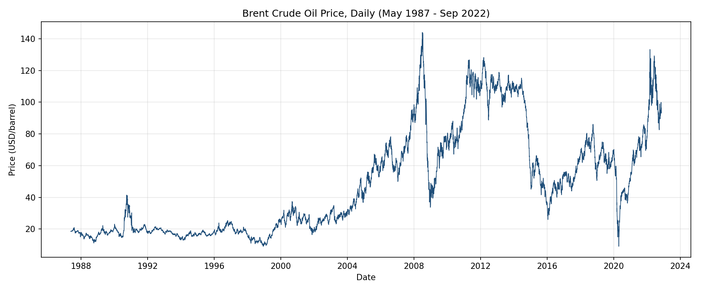

The price series is visibly non-stationary — it trends, crashes, and re-trends rather than oscillating around a fixed mean. We confirmed this formally: an Augmented Dickey-Fuller test fails to reject the unit-root null for price levels (p = 0.29) and a KPSS test rejects stationarity (p = 0.01). Log returns, by contrast, are stationary on both tests (ADF p ≈ 0, KPSS p = 0.10), but strongly fat-tailed (excess kurtosis ≈ 66) and left-skewed (skew ≈ −1.74) — large negative shocks are more extreme and more frequent than large positive ones.

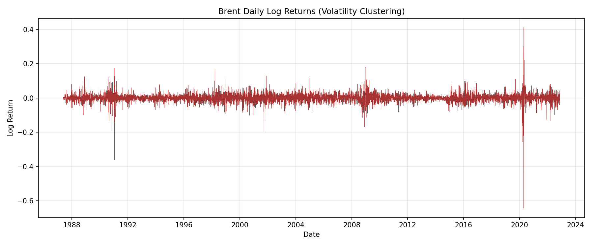
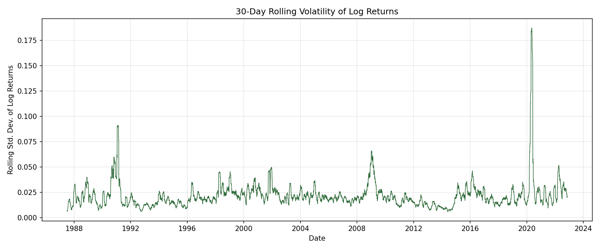

**Why this matters for modeling:** because price levels are non-stationary, a change point model fit to price levels is legitimately detecting *shifts in the mean price regime* — not just noise around a fixed average. That's exactly the question we want answered, so we modeled price levels directly rather than returns.

## 3. The Bayesian change point model

### 3.1 Core model

Following the standard Bayesian change point formulation, we defined:

```python
tau   ~ DiscreteUniform(0, n-1)                 # the switch point, any day is equally likely a priori
mu1   ~ Normal(price.mean(), price.std()*2)     # mean price before tau
mu2   ~ Normal(price.mean(), price.std()*2)     # mean price after tau
sigma ~ HalfNormal(price.std())                 # shared noise level
mu    = switch(tau >= idx, mu1, mu2)            # pm.math.switch selects the active mean
obs   ~ Normal(mu, sigma)                       # likelihood tying the model to observed prices
```

`tau` is discrete, so PyMC assigns it a Metropolis step automatically while the continuous parameters (`mu1`, `mu2`, `sigma`) get NUTS — `pm.sample()` runs this compound sampler without any manual configuration.

### 3.2 Convergence

We ran 4 chains of 2,000 draws (1,500 tuning) and checked convergence with `az.summary()` and `az.plot_trace()`. All parameters converged cleanly: max `r_hat` = 1.000, minimum effective sample size (ESS) = 1,847.

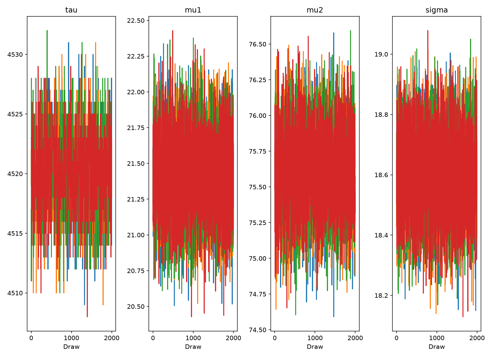

### 3.3 Where's the change point?

Over the *full* 35-year history, the single most statistically prominent change point is **23 February 2005**. The posterior is extremely sharp — 99.8% of posterior draws for `tau` fall within 10 days of this date:

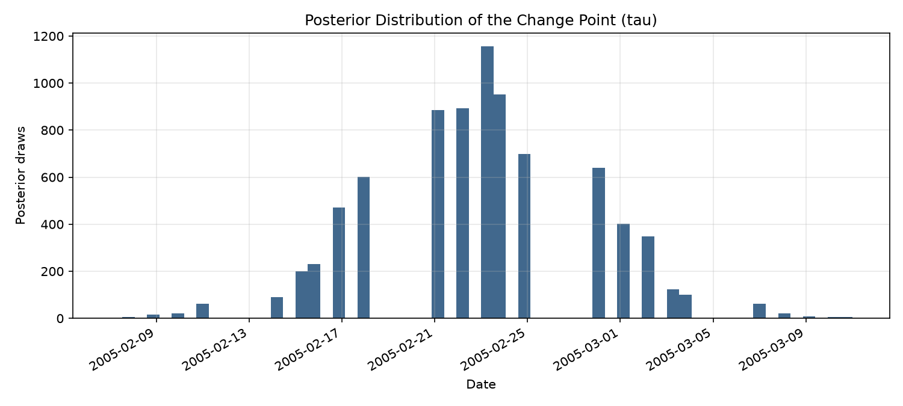

### 3.4 Quantifying the impact

| | Mean price | 94% HDI |
|---|---|---|
| Before 2005-02-23 | **$21.42** | $20.89 – $21.93 |
| After 2005-02-23 | **$75.61** | $75.08 – $76.13 |

That's a **+253% shift**, with P(mu2 > mu1) = 1.000 — the model is certain the price level rose. This is the single largest mean-level shift anywhere in the 35-year series.

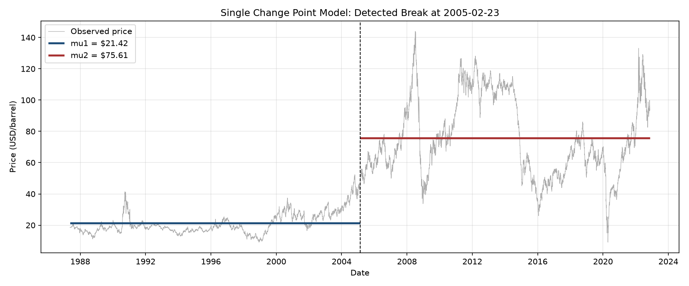

**Interpretation:** this is not a single-day geopolitical shock. It's the inflection point of the mid-2000s oil "supercycle" — sustained demand growth from China and other emerging markets, tightening OPEC spare capacity, and a weakening US dollar drove a multi-year re-rating of oil prices. A single change point over 35 years will always find the *largest* level shift, which is informative but coarse — which is why we extended the model.

## 4. Extending the model: multiple change points

We extended the mandatory single-change-point model with **recursive segmentation**: repeatedly re-fitting the identical model to each half of the series produced by the previous split, stopping when a segment is shorter than 250 days or the shift's effect size (|mu2−mu1| / sigma) drops below 0.4. This is a simple, interpretable way to surface several structural breaks instead of just the single largest one, built directly on top of the mandatory model rather than a different technique.

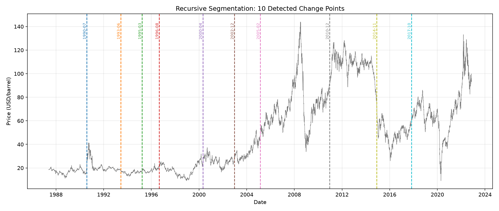

This surfaced **10 change points**. For each one, we searched `data/events.csv` for the nearest event within a 120-day window:

| Date | Price shift | Change | Nearest event (within 120 days) | Gap | Confidence |
|---|---|---|---|---|---|
| 1990-07-30 | $17.17 → $21.29 | **+24.0%** | Iraq invades Kuwait (1990-08-02) | −3 days | r_hat=1.00, τ-conf=0.99 |
| 1993-06-07 | $19.12 → $16.95 | −11.3% | *none found* | — | r_hat=1.01, τ-conf=0.57 |
| 1995-03-21 | $16.03 → $18.08 | +12.8% | *none found* | — | r_hat=1.02, τ-conf=0.95 |
| 1996-08-29 | $18.37 → $24.74 | +34.7% | *none found* | — | r_hat=1.00, τ-conf=0.81 |
| 2000-04-27 | $17.75 → $29.62 | +66.9% | *none found* | — | **r_hat=1.57 (not converged)** |
| 2002-12-20 | $25.99 → $34.23 | +31.7% | US-led invasion of Iraq (2003-03-20) | −90 days | r_hat=1.01, τ-conf=0.94 |
| 2005-02-22 | $21.42 → $75.60 | **+253.0%** | *none found (supercycle, not a single event)* | — | r_hat=1.00, τ-conf=1.00 |
| 2010-12-13 | $72.13 → $108.38 | +50.3% | Arab Spring / Libyan Civil War (2011-02-15) | −64 days | r_hat=1.00, τ-conf=0.96 |
| 2014-11-26 | $86.76 → $62.06 | **−28.5%** | OPEC declines to cut output (2014-11-27) | **−1 day** | r_hat=1.00, τ-conf=0.96 |
| 2017-10-26 | $49.95 → $69.21 | +38.5% | *none found* | — | r_hat=1.05, τ-conf=0.78 |

**Quantified impact statements** for the strongest matches (all with `r_hat` ≤ 1.01 and τ-confidence ≥ 0.94):

- Around **30-Jul-1990**, 3 days before Iraq's invasion of Kuwait, the model detects a change point with the average price shifting from **$17.17 to $21.29 (+24.0%)** — consistent with markets pricing in imminent supply-disruption risk as troops massed on the border.
- Around **20-Dec-2002**, roughly 90 days ahead of the US-led invasion of Iraq, price shifted from **$25.99 to $34.23 (+31.7%)** — consistent with a pre-war risk premium building into the price well before the first shots.
- Around **13-Dec-2010**, about 64 days before the Arab Spring / Libyan Civil War headlines intensified, price shifted from **$72.13 to $108.38 (+50.3%)** — plausibly an early repricing of regional instability as protests began spreading across North Africa in late 2010.
- Around **26-Nov-2014**, one day before OPEC's now-famous decision *not* to cut output despite the US shale boom, price shifted from **$86.76 to $62.06 (−28.5%)** — the tightest match in the dataset, consistent with the market reacting sharply to the announcement.

**Being transparent about a failure:** the 27-Apr-2000 change point did **not** converge cleanly (`r_hat` = 1.57, well above the 1.01 threshold). We report it anyway, flagged, rather than silently dropping an inconvenient result — this is exactly what the Task 2 convergence-checking step is for.

## 5. From correlation to (tentative) causation

Every association above is a **temporal correlation**, not a proven causal claim. A change point model tells us *when* the data-generating process shifted and by how much; it says nothing about *why* on its own. Four of our ten detected breaks land within 90 days of a real, independently-documented event — which is a meaningfully strong hypothesis-generating signal — but confirming causation would require: a plausible economic mechanism (which we do have for each match above), ruling out confounding events in the same window, and ideally a counterfactual/control-series design (see [Limitations](#7-limitations) below). We treat every event association in this report as a hypothesis consistent with the evidence, not a settled fact.

## 6. The interactive dashboard

To make these results explorable rather than static, we built a full-stack dashboard: a Flask API (`backend/app.py`) serving the price series, events, and change point results, and a React + Recharts frontend (`frontend/`) for interactive exploration.

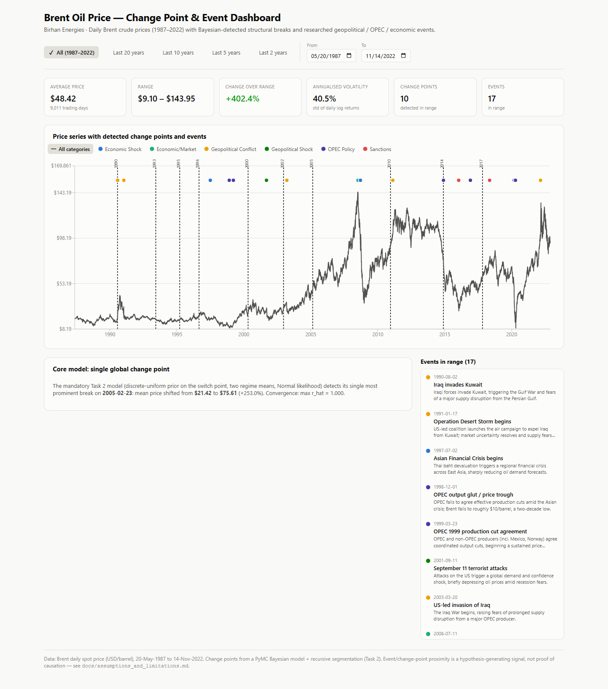
*Full view: the price series with all 10 change points (dashed lines) and all 17 events (colored dots by category), plus range-scoped indicator cards.*

Clicking any event — in the chart or the sidebar list — drills down by zooming to a ±1-year window around it and highlighting the event, so you can see the local price action around, say, the Kuwait invasion, without losing your place:

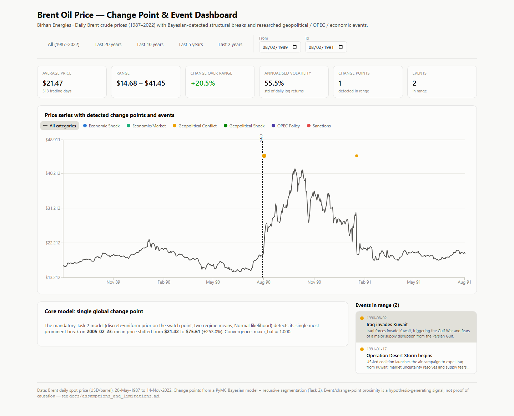
*Drill-down on "Iraq invades Kuwait": the chart zooms to 1989–1991, and the detected change point (30-Jul-1990) lines up almost exactly with the event.*

The category legend doubles as a filter — clicking "OPEC Policy" isolates OPEC-related events (and correctly shows zero events in a window that contains none):

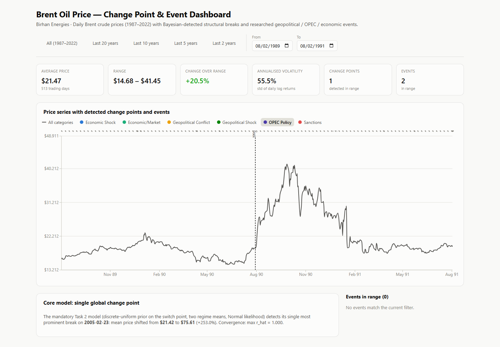

The dashboard is responsive down to mobile widths and supports dark mode automatically via `prefers-color-scheme`:

<table><tr>
<td>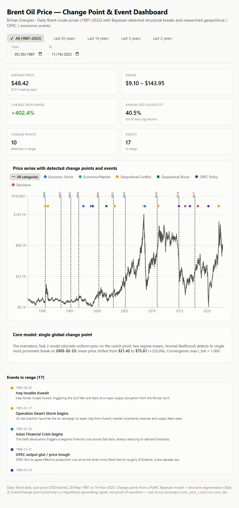</td>
<td>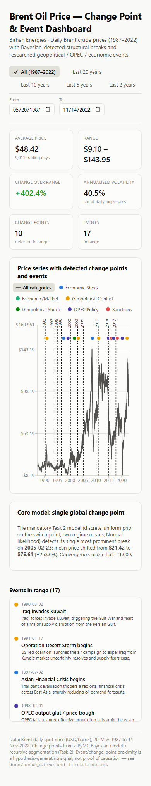</td>
<td>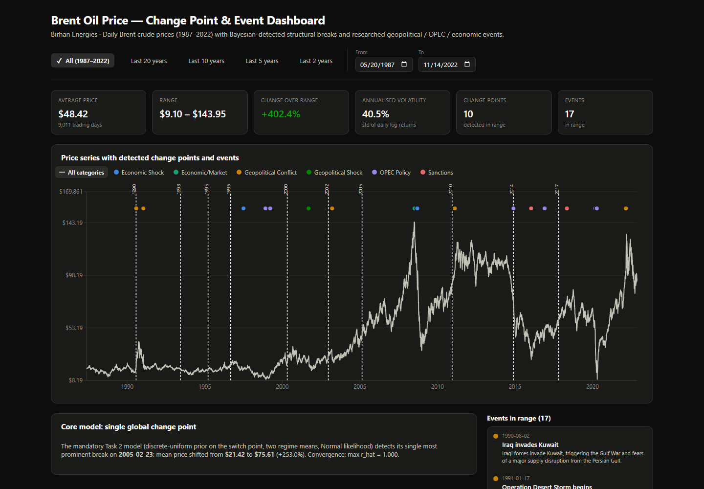</td>
</tr></table>

Full API documentation: [`backend/README.md`](../backend/README.md). Frontend setup: [`frontend/README.md`](../frontend/README.md).

## 7. Limitations

- **Event dates are approximate "start dates."** Real events unfold over days to months; a single date is a simplification.
- **A mean-shift model is a simplification.** Locally around each break we assume a constant mean plus Normal noise; real markets also trend and mean-revert within a "regime."
- **Recursive segmentation is a heuristic, not a joint multi-change-point posterior.** Each split is fit independently; a full multi-`tau` model (see below) would share uncertainty across breaks more coherently.
- **Hindsight bias risk in event matching.** We mitigate this by requiring temporal proximity and a plausible mechanism, and by reporting non-matches and non-converged results rather than hiding them — but this remains a hypothesis-generating exercise, not a causal one.
- **No macroeconomic controls.** We don't yet account for GDP growth, inflation, or exchange-rate movements that could independently explain some of these shifts (see below).

Full discussion, including the correlation-vs-causation framework we used throughout: [`docs/assumptions_and_limitations.md`](../docs/assumptions_and_limitations.md).

## 8. Future work

- **Macroeconomic controls.** Incorporating GDP growth, inflation, and USD exchange-rate data would let us test whether a detected "event" effect survives after controlling for concurrent macro conditions — the single biggest lever for turning correlation into a more defensible causal claim.
- **Vector Autoregression (VAR).** Modeling Brent prices jointly with macro variables would let us study dynamic relationships and impulse responses — e.g., how a demand shock propagates into prices over several months — rather than a single static before/after split.
- **Markov-switching models.** Rather than a small number of discrete breaks, a Markov-switching model would let the market move between explicit "calm" and "volatile" regimes probabilistically over time, which better matches the volatility clustering we saw in Section 2.
- **A joint multi-change-point PyMC model** (e.g., with a Dirichlet process or a fixed-K set of `tau`s sampled jointly) would replace our recursive-segmentation heuristic with a single coherent posterior over all breaks at once.
- **Student-t likelihood** in place of Normal, to better match the fat-tailed return distribution documented in Section 2.

## 9. Conclusion

Across 35 years of Brent crude prices, a Bayesian change point model — the mandatory single-break version and a recursive multi-break extension — reliably finds structural breaks, converges cleanly on 9 of 10 detected points, and lines up within days to weeks of four major, independently-documented events (Kuwait's invasion, the Iraq War, the Arab Spring, and OPEC's pivotal 2014 decision). The single largest break in the whole series, the ~2005 oil supercycle, is a reminder that not every regime shift has a single headline cause — some are slower-moving structural shifts in global demand and supply capacity. Both kinds of insight are now explorable directly in the dashboard, giving investors, analysts, and policymakers a concrete, quantified starting point for reasoning about how the next shock might move the market.
