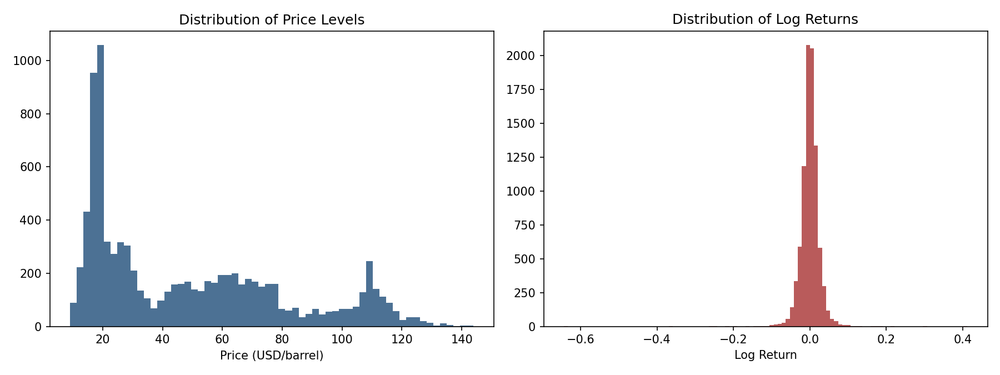

# Interim Report — Change Point Analysis of Brent Oil Prices

**Birhan Energies | Task 1 Deliverable | 13 Jul 2026**

## 1. Business Context

Birhan Energies is analysing how major political and economic events —
conflicts in oil-producing regions, international sanctions, and OPEC policy
decisions — have shaped Brent crude oil prices, to support investment,
policy, and operational decisions. This report covers Task 1: the analysis
workflow, a structured events dataset, and initial exploratory findings on
the price series.

## 2. Planned Analysis Steps (summary)

1. Load and clean the daily Brent price series (20-May-1987 to 14-Nov-2022).
2. Exploratory analysis: trend, stationarity, volatility (this report).
3. Compile a structured dataset of major events (`data/events.csv`, 17 events).
4. Build a Bayesian change point model in PyMC (discrete-uniform prior on
   switch point `tau`, before/after means, `pm.math.switch`, Normal
   likelihood); run MCMC via `pm.sample()`.
5. Check convergence (`r_hat`, trace plots), identify the change point from
   the posterior of `tau`, and quantify the shift in price level.
6. Associate detected change points with researched events and report
   quantified, hypothesis-framed impact statements.
7. Build a Flask + React dashboard exposing prices, change points, and event
   correlations (Task 3).

Full detail: [`docs/analysis_workflow.md`](../docs/analysis_workflow.md).
Assumptions, limitations, and the correlation-vs-causation discussion:
[`docs/assumptions_and_limitations.md`](../docs/assumptions_and_limitations.md).

## 3. Events Dataset

`data/events.csv` contains 17 major events (1990–2022) spanning geopolitical
conflicts, OPEC policy decisions, sanctions, and economic shocks, each with
an approximate start date, category, description, and expected price
direction — e.g. Iraq's invasion of Kuwait (1990-08-02), the 2014 OPEC
decision not to cut output, the 2020 Saudi-Russia price war, and Russia's
invasion of Ukraine (2022-02-24). This list will be cross-referenced against
detected change points in Task 2.

## 4. Initial EDA Findings

**Dataset:** 9,011 daily observations, 20-May-1987 to 14-Nov-2022. Price
range $9.10–$143.95/barrel (mean $48.42, std $32.86).

### 4.1 Trend

The raw series (Fig. 1) shows multiple distinct regimes rather than one
stable trend: a calm period below ~$25/bbl through the late 1990s; a
sustained uptrend from 2002 peaking near $147/bbl in mid-2008; the 2008
financial-crisis crash; a 2011–2014 plateau around $105–125/bbl; the
late-2014 OPEC-driven collapse; a COVID-19 crash to single digits in April
2020; and the 2022 spike following Russia's invasion of Ukraine.

*Figure 1. Brent crude oil daily price, 1987–2022. Vertical structure visibly aligns with major shocks (1990–91 Gulf War, 2008 financial crisis, 2014 OPEC glut, 2020 COVID-19, 2022 Ukraine invasion).*

### 4.2 Stationarity

| Series | ADF p-value | KPSS p-value | Conclusion |
|---|---|---|---|
| Price level | 0.289 | 0.010 | **Non-stationary** |
| Log return | ≈0.000 | 0.100 | **Stationary** |

Price levels fail to reject the ADF unit-root null and reject the KPSS
stationarity null — consistent with the visible trending/regime behaviour.
Log returns are stationary on both tests. **Implication:** a change point
model applied to price levels detects shifts in the *mean price level*
(regime shifts), which is the quantity of direct business interest; log
returns are the right series for any future volatility-regime or ARIMA/GARCH
work.

### 4.3 Volatility

Log returns (Fig. 2) show clear **volatility clustering** — large swings
bunch together in time around 1990–91, 2008–09, 2014–16, and 2020, rather
than being spread uniformly — and a 30-day rolling standard deviation (Fig.
3) makes these high-volatility windows explicit. The return distribution
(Fig. 4) is strongly fat-tailed (excess kurtosis ≈ 66) and left-skewed
(skew ≈ −1.74): large negative shocks are more extreme and more frequent
than large positive ones.

*Figure 2. Daily log returns, showing volatility clustering.*

*Figure 3. 30-day rolling standard deviation of log returns.*

*Figure 4. Distribution of price levels (left) vs. log returns (right).*

### 4.4 Modeling Implications

- Non-stationary price levels + multiple visible regimes → a **change point
  model on price levels** (not a single global mean/trend model) is the
  right tool to identify structural breaks.
- Fat-tailed, clustered volatility → a Normal likelihood is a reasonable
  starting point for the Task 2 mean-shift model, with a Student-t
  likelihood and/or explicit volatility-regime (Markov-switching) modeling
  as a natural extension (see "Advanced Extensions" in the project scope).

Full reproducible analysis: [`notebooks/eda.ipynb`](../notebooks/eda.ipynb)
(executed, with outputs) and [`scripts/eda.py`](../scripts/eda.py).

## 5. Assumptions & Limitations (summary)

Event dates are approximate; the model assumes a locally constant mean
around each break; and — critically — a detected change point is a
**statistical correlation in time**, not proof that a specific event
*caused* the shift. See
[`docs/assumptions_and_limitations.md`](../docs/assumptions_and_limitations.md)
for the full discussion, including what would be required to move from
correlation to a causal claim (plausible mechanism, ruling out confounders,
counterfactual/control-series reasoning).
